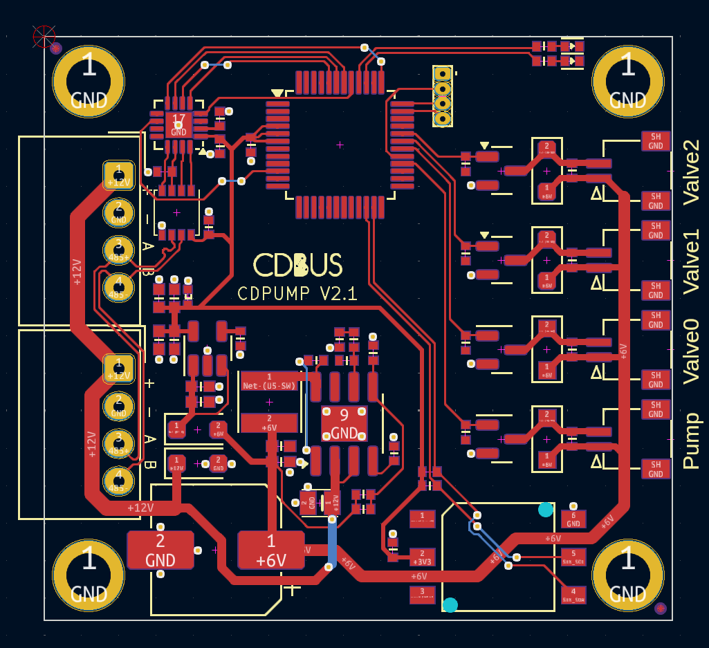

CDPUMP Introduction
=======================================

## Protocol

CDPUMP is an open-source pump controller that communicates over an RS485 interface.
 - Default baud rate: 115200 bps
 - Maximum speed: 50 Mbps
 - Default address: 0xfe

The underlying protocol is CDBUS, with the following frame format:  
`src, dst, len, [payload], crc_l, crc_h`

Each frame includes a 3-byte header, a variable-length payload, and a 2-byte CRC (identical to Modbus CRC).  
For more information on the CDBUS protocol, please refer to:
 - https://cdbus.org

The payload is encoded using the CDNET protocol. For detailed information, please refer to:
 - https://github.com/dukelec/cdnet
 - https://github.com/dukelec/cdnet/wiki/CDNET-Intro-and-Demo

## Valve Status

| Valve2 | Valve1 | Valve0 | DESCRIPTION   |
|--------|--------|--------|---------------|
| 0      | 0      | 0      | Open          |
| 0      | 1      | 1      | Suck          |
| 1      | 0      | 1      | Blow          |

## Suck Only (For CDPnP)

## Suck & Blow (Deprecated)

## Hardware

Schematic: <a href="hardware/cdpump_sch_v2.1.pdf">cdpump_sch_v2.1.pdf</a>

